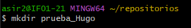
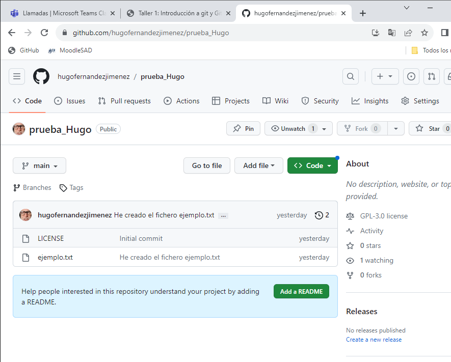
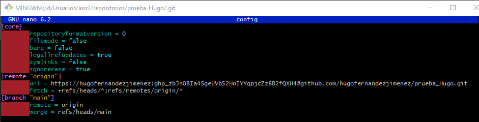
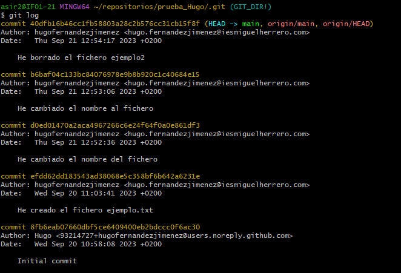
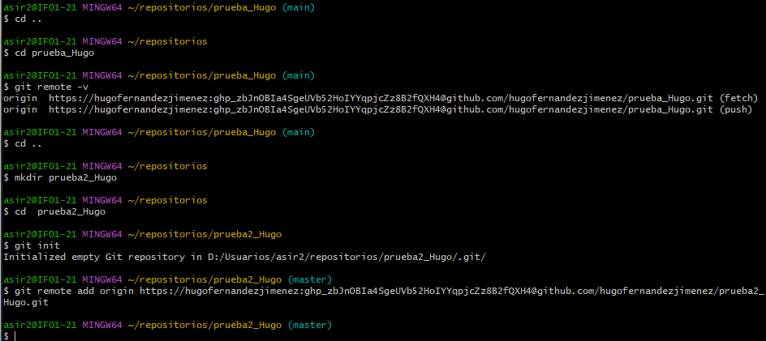
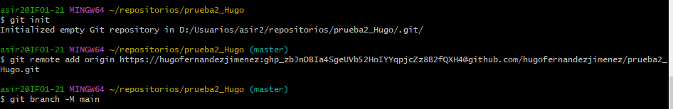
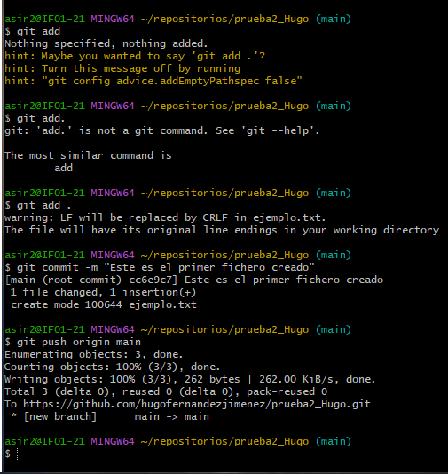
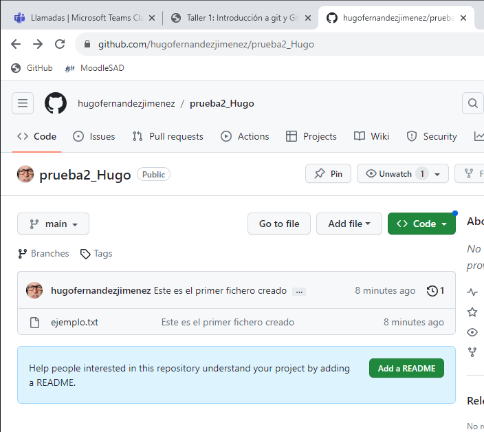

# Taller 1 
## 1. Una captura de pantalla donde se vea que has creado correctamente el repositorio.
### Creo el repositorio

### Repositorio desde GitHub

## 2.El contenido del fichero .git/config para que se vea que has clonado el repositorio con la URL ssh (o la URL https si te has conectado por token).
### git./config

## 3. La salida de la instrucción git log para ver los commits que has realizado (debe aparecer como autor tu nombre completo).
### GitLog con todos los Commits realizados

## 4. Buscar información para crear un nuevo repositorio llamado prueba2_tu_nombre. En esta ocasión, crea primero el repositorio local (usando git init) y luego busca información para sincronizarlo y crear el repositorio remoto en GitHub. Comenta los pasos que has realizado y manda alguna prueba de funcionamiento.
### Creamos la carpeta nueva

### Hacemos un remote para conectarlo con el repositorio en la nube

### Hacemos el push

### Asi se ve en la nube

